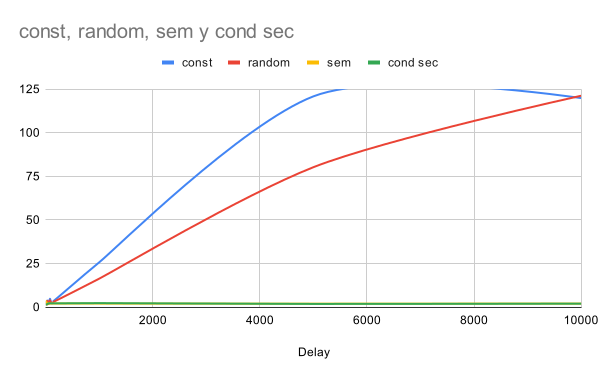
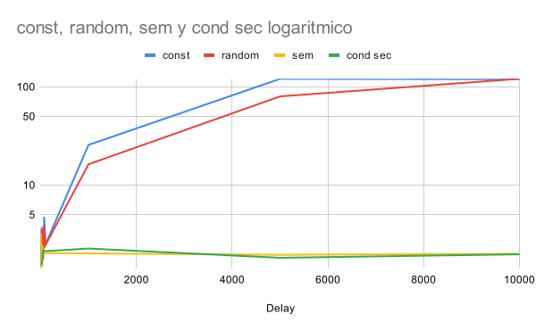

= Espera activa con retraso
:experimental:
:nofooter:
:source-highlighter: pygments
:stem:
:toc:
:xrefstyle: short

¿Se corrige el problema de la espera activa si en lugar de tener un ciclo vacío, se espera un cierto tiempo? Copie su carpeta `pthreads/hello_order_busywait` a `pthreads/delayed_busy_wait`. Permita que el usuario pueda invocar su programa con dos argumentos de línea de comandos: la cantidad de hilos a crear, y la cantidad de microsegundos a esperar cuando no es el turno del hilo de ejecución.

*Espera activa con retraso constante*. Si no es el turno de un hilo, éste espera una cantidad constante de microsegundos, algo como:

[source,c]
----
// Constant delayed busy waiting: wait until it is my turn
while (next_thread < my_thread_id) {
  usleep(delay);
}
----

*Espera activa con retraso pseudoaleatorio*. Altere su solución al ejercicio para que en lugar de esperar exactamente la cantidad de microsegundos indicada por el usuario, espere por una cantidad pseudoaleatoria de microsegundos cuyo límite es el número indicado por el usuario en el segundo argumento de línea de comandos. Sugerencia: puede usar compilación condicional para implementar esta variación. La espera varía en cada iteración del ciclo de espera activa, algo como:

[source,c]
----
// Random delayed busy waiting: wait until it is my turn
while (next_thread < my_thread_id) {
  const unsigned my_delay = rand_r(&my_seed) % max_delay;
  usleep(my_delay);
}
----

Recuerde probar la calidad de su código (_sanitizers_, _linter_).

*Comparación de las esperas*. ¿Mejora el tiempo de ejecución de los dos tipos de esperas (constante y pseudoaleatoria) si disminuye o incrementa la espera máxima de los hilos? Ejecute al menos tres veces su solución pseudoaleatoria con la cantidad máxima de hilos, y tome la que duró más (pues se está comparando qué tan grave/nociva es una solución respecto a otra) y con al menos los siguientes tiempos de espera:

. 1µs
. 5µs
. 25µs
. 50µs
. 75µs
. 100µs
. 1000µs
. 5000µs
. 10000µs

Sugerencia: si hay varios compañeros(as) trabajando el mismo ejercicio en el laboratorio, escojan tiempos diferentes y compartan los resultados. Pueden crear una gráfica en un documento compartido. Agreguen más tiempos de ejecución si hay más de 6 integrantes.

Cree una gráfica donde el eje-x son las duraciones dadas por argumento al programa. El eje-y son los tiempos de ejecución de los programas. El gráfico tendrá dos series, una para la espera constante y otra para la espera pseudoaleatoria. Exporte la gráfica en formato SVG (_scalar vector graphics_).

Agregue la gráfica al `readme.adoc` del ejercicio y una discusión de a lo sumo dos párrafos. Indique cuál fue el mejor tiempo máximo de espera obtenido y los efectos de disminuir o incrementarlo. Conjeture y trate de explicar por qué ocurre este comportamiento. Finalmente indique si la espera activa con retraso es una solución óptima, y en caso negativo, provea una idea que pueda lograr este ideal.

Si trabajó en equipos, indique además en el `readme.adoc` del ejercicio, los nombres de los miembros que participaron. Todos los miembros tendrán duplicado este documento en sus repositorios privados.

.Gráfica tiempos de ejecución

.Gráfica tiempos de ejcución logaritmica

== conclusiones
* El mejor fue de 1.472308175 con un delay de 5µs.

=== Efectos de disminuir o incrementar el tiempo de espera

Al disminuir el tiempo de espera, el tiempo de ejecución del programa disminuye. Esto se debe a que los hilos pasan menos tiempo en espera activa y más tiempo ejecutando su trabajo.
Al aumentar el tiempo de espera, el tiempo de ejecución del programa aumenta. Esto se debe a que los hilos pasan más tiempo en espera activa y menos tiempo ejecutando su trabajo.

* No hay forma de mejorar la espera activa, ya que el problema de la espera activa es que consume CPU y no permite que otros hilos se ejecuten. La espera activa con retraso simplemente agrega un tiempo de espera, pero no resuelve el problema subyacente de la espera activa.
* La espera activa con retraso constante puede ser más eficiente que la espera activa sin retraso, pero aún así consume CPU y no permite que otros hilos se ejecuten.
* La espera activa con retraso pseudoaleatorio puede ser más eficiente que la espera activa con retraso constante, pero aún así consume CPU y no permite que otros hilos se ejecuten.
* La espera activa sigue siendo nosciva y la unica forma de mejorarla es cambiarla por otra estructura de control de concurrencia.
* El semaforo y seguridad concicional son de valor constante.

=== Integrantes:
* Isaías Alfaro Ugalde C20261.
* Axel Rojas Retana C36944.