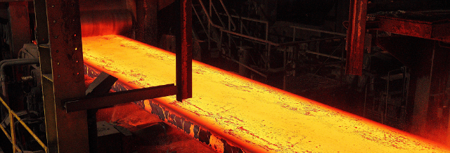
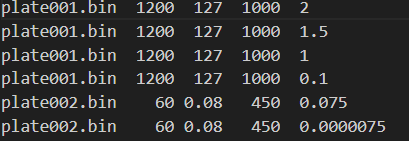
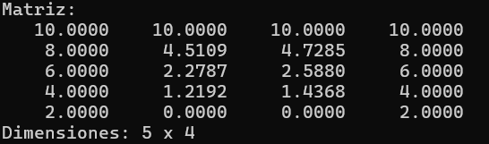
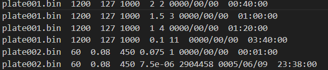
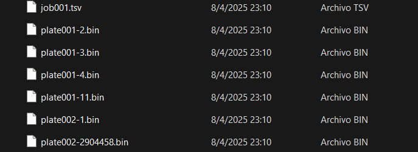
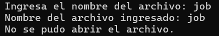
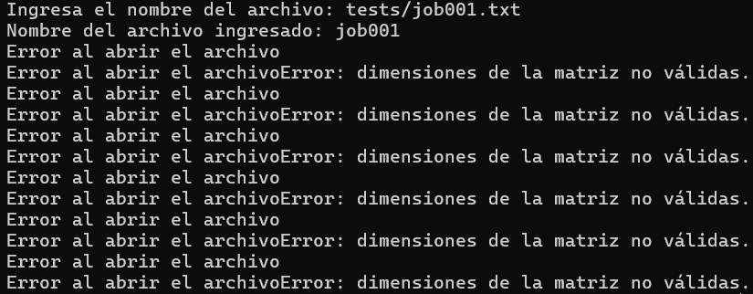

= Serial_heat_transfer

*Isaías Alfaro Ugalde <isaias.alfaro@ucr.ac.cr>*

---

:experimental:
:nofooter:
:source-highlighter: highlight.js
:sectnums:
:stem: latexmath
:toc:
:xrefstyle: short

== Problema

El problema se basa en simular con cierta exactitud cómo se comporta el calor en una lámina. Esto se logra mediante una simulación de inyeción de calor en la propia lámina. Luego, la simulación se ejecuta durante un tiempo determinado, hasta alcanzar un punto de equilibrio, donde el cambio de temperatura es lo suficientemente bajo para considerarse estable.

=== Solucion

La solución consta de tres partes, los cuales son:

* *Fórmula*: La simulación de la inyección de calor se basa en una fórmula matemática para poder generar con cierta precisión cómo se distribuye y expande el calor a lo largo de la lámina y del tiempo de ejecución. La fórmula es la siguiente:

[latexmath]
++++
T ^{k+1} _{ i, j} = T^k _{ i, j} + \frac{Δt⋅α}{h2} (T^k _{i−1, j}+ T^k _{i, j+1} + T^k _{i+1,j} + T^k _{i, j−1} − 4T^k _{i,j})
++++

* *Notación usada*: *T* esta variable nos va a indicar el calor; la misma va acompañada de tres variables: *K*, esta nos indica el instante donde se calcula el calor, y además va acompañada de *i, j*, estas dos variables nos indican la posición en la placa. Tenemos otras variables, las cuales son *Δt*, este es el tiempo de cada instante; *α*, es la difusividad térmica; y por último *h*, que nos indica el tamaño de las celdas de la lámina. A continuación se van a describir cómo afectan estas variables a la ejecución del programa. Para un mayor entendimiento de la fórmula, consulta la sección "https://jeisson.ecci.ucr.ac.cr/concurrente/2025a/tareas/#problem_statement[Transferencia de calor]".

* *Variables*: El programa es susceptible a muchas variables durante el proceso, con el fin de lograr una simulación lo más realista posible. Entre estas variables se encuentra el material de la lámina, cuya difusividad térmica determina qué tan buen conductor de calor es. Luego, el tamaño de la lámina influye en el tiempo necesario para alcanzar el equilibrio térmico: cuanto más grande o más pequeña sea, el proceso tomará una duración diferente. Por último, el intervalo de tiempo define la frecuencia con la que se analiza la distribución del calor en la lámina para determinar si ha alcanzado el equilibrio. 

* *Equilibrio*: Esta es una de las partes más importantes de la simulación, ya que nos indica en qué momento debemos detenerla. El punto de equilibrio en la lámina se determina mediante una comparación con un valor específico: la transferencia de calor debe mantenerse por encima de este valor para que siga siendo significativa dentro de la simulación. Por ello, es fundamental tener en cuenta esta variable.

=== Diseño

Para el diseño del programa se van a utilizar estructuras. Estas nos brindan una posibilidad de trabajo mucho más compacta y ayudan a resolver el problema de una mejor manera. Si quiere conocer las distintas estructuras y la estructura de datos usada para el problema, consulte la sección link:design/readme[diseño].

== Manual de usuario

=== Creacion del programa

Para creacion de este programa se utiliza un makefile, esto agiliza mucho el proceso. Los pasos a seguir son:

. Abrir una terminal y ubicarse en la carpeta llamada homeworks/serial.
. En esta terminal se tiene que escribir el siguiente comando "make".
. Este comando va a construir por completo la solución de la tarea.

=== Uso del programa

Para el uso del programa, primero se recomienda hacer la creacion del mismo pero no es obligatorio. Los pasos a seguir son:

. En la misma terminal de creacion, se tiene que escribir el siguiente comando "make run".
. Este comando va a compilar y ejecutar la solución de la tarea. 
. En el archivo makefile propio de la tarea se prove un espacio  de 'ARGS' donde se pueden ingresar los argumentos que se le van a pasar al programa. En este caso, el argumento que se le debe pasar es el nombre del archivo de entrada, el cual debe ser un archivo de texto con la extensión .txt. Este archivo debe contener la información necesaria para la simulación, como se explica en la sección "Archivos del programa". Y por ultimo, la cantiadad de hilos que se van a utilizar en la simulación, este valor debe ser un número entero positivo.

=== Archivos del programa

Como se menciono anteriormente se ocupan los archivos jobxxx.txt y los plate(laminas). A continuación se brindaran dos ejemplos de como son los archvios y su contenido.

Como se puede apreciar este es el archvio Jobxxx.txt, este archvivo contiene la lámina que se va a utilizar, el tiempo de cada simulación, el material, las dimensiones y el punto de equilibrio por alcanzar.

Los archivos plate.bin son archivos binarios que contienen la informacion del calor y las dimensiones de la matriz, esta imagen ejemplifica esta información para que el usuario tenga una idea clara de como es que se ubica la infomación dentro del archivo. Vemos el las celdas con el calor y se ve como se menciona las dimensiones de la matriz.

=== Ejemplo de ejecución

[source, makefile]
--
ARGS=tests/job001.txt 8
--
== Resultado del programa

El programa luego de su finalización va ha haber creado una lista de archivos. Estos son de la siguiente forma:

jobxxx.tsv :: Este archivo de reporte indicará la lámina original que se utilizó, el tiempo transcurrido, el material, las dimensiones, el punto de equilibrio por alcanzar y, por último, cuántas veces se realizó la simulación para llegar al punto de equilibrio.

A continuación un ejemplo del archivo es el siguiente:

platexxx-x.bin :: Este archivo corresponde a la lámina final luego de la simulación. Contiene la distribución del calor alcanzada durante la fase de simulación. Su propósito es almacenar esta información para su uso en el futuro. El nombre del archivo se forma a partir de la lámina original utilizada y la cantidad de estados que se alcanzaron hasta llegar al punto de equilibrio.

=== Ejemplo de salida 

=== Errores

El programa cuenta con un sistema de manejo de errores, cuyo propósito es proporcionar explicaciones sobre por qué se produjo una falla durante la ejecución. Esto permite al usuario comprender mejor lo ocurrido y facilita el proceso de corrección. A continuación, se presentan algunos ejemplos de errores gestionados por el programa:

En este error no pudo encontrar el archivo job que el usuario le brindo al principio.

En este vemos que no encontro los archivos plate, por lo cual no puede crear las placas a usar en la ejecucion.

== Créditos

Isaías Alberto Alfaro Ugalde <isaias.alfaro@ucr.ac.cr>.

Jeisson Hidalgo Céspedes <jeisson.hidalgo@ucr.ac.cr>.