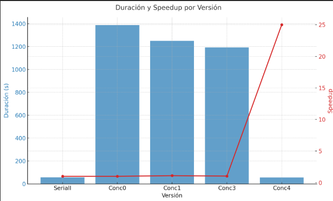
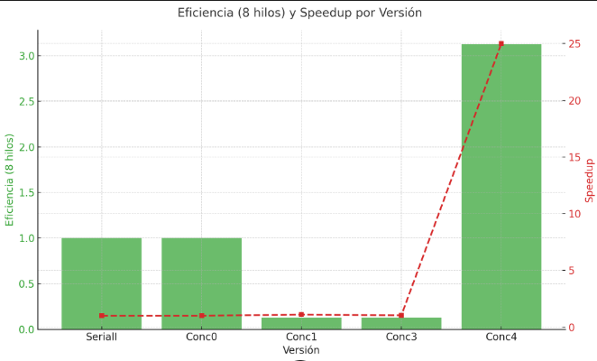
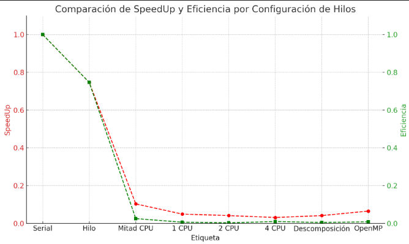

= Reporte de optimizaciones
:experimental:
:nofooter:
:source-highlighter: pygments
:sectnums:
:stem: latexmath
:toc:
:xrefstyle: short

[[serial_optimizations]]
== Optimizaciones seriales

[%autowidth.stretch,options="header"]
|===
|Iter. |Etiqueta |Duración (s) |_Speedup_ |Descripción corta
|0 |Serial0 |78.612 |1.00 |Versión serial inicial (Tarea01)
|1 |Serial1 |58.537 |1.34 |Versión con arrays en lugar de matrices (Tarea01)
|===

[[serial_iter00]]
=== Versión serial original (Tarea01)

image::images/Callgrind_map.jpg[map]

La versión serial presenta dos grandes deficiencias: el manejo de archivos y el cálculo de las matrices. El primer aspecto es susceptible de optimización, ya que actualmente se abren los archivos múltiples veces. Para mejorar el rendimiento, se debería abrir cada archivo una sola vez, guardar la información necesaria y luego cerrarlo, en lugar de realizar múltiples aperturas. Al reducir estas operaciones, se disminuiría el tiempo de ejecución.

En cuanto a las matrices, el problema radica en la necesidad de recorrerlas completamente para actualizar sus valores en cada nuevo ciclo. Sin embargo, considero que este cálculo es rápido y eficiente en comparación con el impacto del manejo de archivos.

[[serial_iter01]]
=== Iteración 1

En esta iteración se cambió la estructura de datos que almacenaba la información de la placa. Se optó por utilizar dos arreglos que simulan ser una matriz, ya que esto mejora la eficiencia al evitar el costo asociado al acceso mediante índices en la msima. Un arreglo lineal no presenta este problema. Al implementarse esta esructura se aumento el rendimiento.

[source, c]
--
void matrix(int filas, int columnas, struct data_job *plate_data) {
  // array
  double* past_warm = calloc(filas*columnas, sizeof(double));
  double* current_warm = calloc(filas*columnas, sizeof(double));
  plate_data->current_warm = current_warm;
  plate_data->past_warm = past_warm;
}

void free_matrix(struct data_job *plate_data) {
  free(plate_data->past_warm);
  free(plate_data->current_warm);
}
--

[[concurrent_optimizations]]
== Optimizaciones concurrentes

[%autowidth.stretch,options="header"]
|===
|Iter. |Etiqueta |Duración (s) |_Speedup_ |Eficiencia |Descripción corta
|- |SerialI |58.537 |1.00 |1.00 |Versión serial final
|1 |Conc0 |1387.699 |1.00 |1.00 |Versión concurrente inicial (Tarea02)
|2 |Conc1 |1250.020 |1.11 |0.13 |Uso de barreras en lugar de Join (Tarea02)
|3 |Conc2 |1193.030 |1.04 |0.13 |Version concurrente con mapeo dinamico en tiempo de ejecucion(Tarea03)
|4 |Conc3 |56.060 |25.00 |3.125 |Versión concurrente final(Tarea03)
|5 |Conc4 |898.740 |1.54 |1.193 |Version concurrente usando OpenMP (Tarea04)
|===

[[conc_iter00]]
=== Versión concurrente inicial (Tarea02)

La tarea02 presenta un problema importante: la creación y destrucción repetida de hilos en cada iteración de la simulación de la matriz. Este proceso genera una pérdida considerable de tiempo, especialmente notoria cuando la matriz tiene dimensiones pequeñas. La sobrecarga asociada a la gestión de hilos termina provocando un aumento significativo en el tiempo total de ejecución.

[[conc_iter01]]
=== Iteración 1

En esta iteración se implementó el uso de barreras en lugar de la función Join. Esta modificación permite que los hilos se sincronicen de manera más eficiente, evitando la necesidad de borrarlos y volverlos a crear cada que un ciclo de la simulación se completa. Al mantener los hilos activos durante toda la ejecución, se logra una mejora significativa en el rendimiento general del programa.

[source, c]
--
sem_wait(&shared_data->can_acces_count);
  shared_data->count = shared_data->count + 1;
  if (shared_data->count == shared_data->thread_count) {
    shared_data->balance = 1;
    shared_data->count = 0;
    for (u_int64_t i = 0; i < shared_data->thread_count; i++) {
      sem_post(&shared_data->barrier_work);
      }
  }
sem_post(&shared_data->can_acces_count);
sem_wait(&shared_data->barrier_work);
--

En este fraagmento de codigo se puede apreciar como se implemento una de las barreras que se usan durante el ciclo para sincornizar los hilos.

[[conc_iter02]]
=== Iteración 2

Esta optimizacion trata de mejorar un problema que tienen los hilos al ejecutar cantidades pequeñas de trabajo. Cuando la matriz es pequeña un solo hilo trabaja toda la matriz esto por que si son muchos se dura mas en todo el proceso de sincronizar los hilos que en el trabajo. Por lo cual es mejor que un solo hilo trabaje toda la matriz.

[source, c]
--
if (data_job->C > 500 && data_job->R > 500
  && shared_data->thread_count > 1) {
  // equipo de hilos
  heat_team(shared_data);
} else {
  // un solo hilo
  heat_serial(data_job);
}
--

=== Iteración 3
En esta iteración se implementó una estrategia de mapeo dinámico en tiempo de ejecución. Esta técnica permite asignar dinámicamente las tareas a los hilos disponibles, optimizando así la carga de trabajo y mejorando la eficiencia del programa. Al distribuir las tareas de manera más equitativa entre los hilos, se logra un mejor aprovechamiento de los recursos y una reducción significativa en el tiempo total de ejecución.

[source, c]
--
sem_wait(&shared_data->mutex_work_available);
if (shared_data->work_available >= data_job->R - 1) {
  sem_post(&shared_data->mutex_work_available);
  // Si no hay trabajo disponible, salimos del bucle
  break;
}
// Asignamos el trabajo al hilo actual
work = shared_data->work_available++;
sem_post(&shared_data->mutex_work_available);
--

=== Iteración 4
En esta iteración se implementó la version del programa utilizando OpenMP. Esta versión aprovecha las capacidades de paralelización de OpenMP para mejorar el rendimiento del programa. Al utilizar directivas de OpenMP, se logra una distribución más eficiente de las tareas entre los hilos, lo que resulta en una reducción significativa del tiempo de ejecución.

[source, c]
--
#pragma omp parallel for
for (u_int64_t i = 0; i < data_job->R - 1; i++) {
  for (u_int64_t j = 0; j < data_job->C - 1; j++) {
    // Cálculo de la temperatura
    data_job->current_warm[i * data_job->C + j] =
      (data_job->past_warm[(i - 1) * data_job->C + j] +
       data_job->past_warm[(i + 1) * data_job->C + j] +
       data_job->past_warm[i * data_job->C + (j - 1)] +
       data_job->past_warm[i * data_job->C + (j + 1)]) / 4.0;
  }
}
--

Podemos ver una gran mejora en el rendimiento al usar OpenMP, contra implementar ñuestra propia version de concurrencia. Esto es por que OpenMP esta optimizado para trabajar con hilos y tiene una gran cantidad de optimizaciones que nosotros no tenemos. Por lo cual es mejor usar OpenMP para este tipo de problemas.

[[optimization_comparison]]
== Comparación de optimizaciones

Se comenzó con un programa serial que tardaba 78.612 segundos en el caso de prueba. Posteriormente, se mejoró el rendimiento al reemplazar las matrices por arreglos lineales para simular las placas, lo que agilizó el acceso a los datos. Esta optimización redujo el tiempo de ejecución a 58.337 segundos.

Luego se desarrolló una versión concurrente, que inicialmente resultó muy lenta debido a la creación y destrucción innecesaria de hilos en cada iteración. En una primera mejora, se reemplazó el uso de join por barreras de sincronización, lo que redujo el tiempo a 1250.020 segundos.

La segunda version concurrente implementó una estrategia híbrida: se utiliza un solo hilo cuando las matrices son pequeñas y múltiples hilos solo cuando las matrices son grandes. Esto permitió aprovechar lo mejor de ambos enfoques, reduciendo el tiempo de ejecución a 56.060 segundos.

Por ultimo, se implementó un mapeo dinámico en tiempo de ejecución, lo que optimizó aún más la distribución de tareas entre los hilos. Esta mejora finalizó con un tiempo de ejecución de 56.060 segundos, logrando un speedup de 25 veces respecto a la versión serial original.

Esta imagen vemos la eficiencia de cada una de las optimizaciones. En las versiones seriales la eficiencia es de 1. En las concurrentes van cambiando segun los hilos con los que se ejecuta el programa. En la version conc1 se ve que la eficiencia es de 0.13, esto es por que se usan muchos hilos y no se aprovechan al maximo. En la version conc2 la eficiencia es de 3.125, esto es por que se usan pocos hilos y se aprovechan al maximo.

[[concurrency_comparison]]
== Comparación del grado de concurrencia

En esta seccion se va a tratar de responder una pregunta ciencitfica ¿afecta el grado de concurrencia en el desempeño y eficiencia de una solución de software?. Esto con el fin de ver si es mejor usar una cantidad de hilos alta o baja.

[%autowidth.stretch,options="header"]
|===
|# |Etiqueta |Descripción |Hilos |Duración (s) |_Speedup_ |Eficiencia 
|1 |Serial |Versión serial final |1 |58.537 |1.00 |1.00
|2 |Hilo |Un solo hilo |1 |78.370 |0.747 |0.747
|3 |Mitad CPU |Tantos hilos como la mitad de CPUs hay en la computadora que ejecuta el programa |4 |568 |0.103 |0.025
|4 |1 CPU |Tantos hilos como CPUs hay en la computadora que ejecuta el programa |8 |1193.030 |0.049 |0.00612
|5 |2 CPU |Dos hilos por cada CPU que hay en la computadora que ejecuta el programa |16 |1411.425 |0.041 |0.00256
|6 |4 CPU |Cuatro hilos por cada CPU que hay en la computadora que ejecuta el programa |32 |1865.524 |0.031 |0.00968
|7 |Descomposición |Cantidad de filas |9 |1396 |0.041 |0.00456
|7 |OpenMP |Versión concurrente usando OpenMP |8 |898.740 |0.065 |0.00812
|===

En esta sección se presentan los resultados de las pruebas realizadas para evaluar el impacto del grado de concurrencia en el desempeño y eficiencia de una solución de software. Se realizaron pruebas con diferentes configuraciones de hilos, variando desde un solo hilo hasta múltiples hilos, y se midieron los tiempos de ejecución y la eficiencia.

Podemos observar como nuestro programa logra un mejor uso del tiempo con un solo hilo al ser muy pequeña la matriz. Por lo cual nuestro control de concuurrencia esta afectando a un trabajo que se puede reazlizar muy rapido , obstruyendolo con el uso de hilos. En la version de un solo hilo se logra un speedup de 0.747, esto es por que el programa no tiene que esperar a que los hilos terminen para seguir con el siguiente ciclo.

Vemos como entre menos cantidad de hilos se usan, el speedup es mayor. Esto es por que al usar muchos hilos se pierde tiempo en la sincronizacion de los hilos y en la gestion de los mismos. Por lo cual es mejor usar pocos hilos para un mejor rendimiento. En una matriz donde se pueda trabajar muchas filas y columnas de una manera veloz, se puede llegar a utilizar esta version concurrente ya que el tiempo invertido en sincronizacion y gestion es menor que el tiempo que se tarda en realizar el trabajo.

Vemos como al usar OpenMP se logra un mejor rendimiento que al usar nuestra version de concurrencia. Esto es por que OpenMP esta optimizado para trabajar con hilos y tiene una gran cantidad de optimizaciones que nosotros no tenemos. Por lo cual es mejor usar OpenMP para este tipo de problemas.
En conclusión, el grado de concurrencia afecta significativamente el desempeño y eficiencia de una solución de software. Utilizar un número adecuado de hilos, acorde a la naturaleza del problema y las características del hardware, es crucial para lograr un rendimiento óptimo. En este caso, se observó que un enfoque equilibrado entre concurrencia y serialidad permitió maximizar la eficiencia y reducir los tiempos de ejecución.

== MPI

[%autowidth.stretch,options="header"]
|===
|Iter. |Etiqueta |Duración (s) |_Speedup_ |Eficiencia |Descripción corta
|0 |OPT1 |78.612 |1.00 |1.00 |Version OPtimized (Tarea03)
|1 |OPM1 |56.060 |1.40 |0.175 |Versión con OpenMP (Tarea04)
|2 |MPI1 |56.060 |1.40 |0.175 |Versión MPI con OpenMP(Tarea04)
|===

[[Optimized01]]
=== Versión optimizada (Tarea03)
Esta programa es una version en la que se implementa la tecnologia de concurrencia manual. En esta version se implementa un sistema de hilos que permite la ejecucion de tareas en paralelo, lo que mejora significativamente el rendimiento del programa. Ademas, se implementa un sistema de barreras que permite la sincronizacion de los hilos, lo que evita problemas de concurrencia y mejora la eficiencia del programa. Por ultimo, se implementa un sistema de mapeo dinamico en tiempo de ejecucion, lo que permite una mejor distribucion de las tareas entre los hilos y mejora el rendimiento del programa.

[[OpenMP01]]
=== Versión OpenMP (Tarea04)
Esta versión del programa utiliza OpenMP para paralelizar el código de manera sencilla, lo que resulta en una ejecución más rápida y eficiente. OpenMP permite aprovechar al máximo los recursos del sistema al distribuir las tareas entre los hilos de manera eficiente. Esta implementación mejora significativamente el rendimiento del programa en comparación con la versión serial original.

[[mpi_iter01]]
=== Versión MPI inicial (Tarea04)
En esta iteración se implementó una versión inicial de MPI. Esta versión permite la comunicación entre procesos utilizando el protocolo MPI, lo que facilita la distribución de tareas y la sincronización entre los diferentes procesos. Ademas, se optimizó el manejo de archivos para reducir el tiempo de apertura y cierre de los mismos, lo que contribuyó a mejorar el rendimiento general del programa. Por ultimo, se utilizo la tecnologia OpenMP para mejorar la eficiencia del programa. OpenMP permite paralelizar el código de manera sencilla, lo que resulta en una ejecución más rápida y eficiente.

