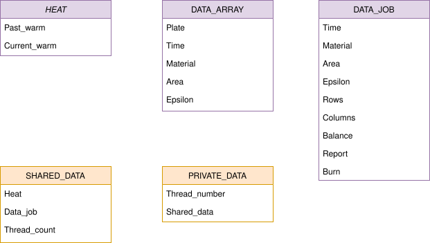
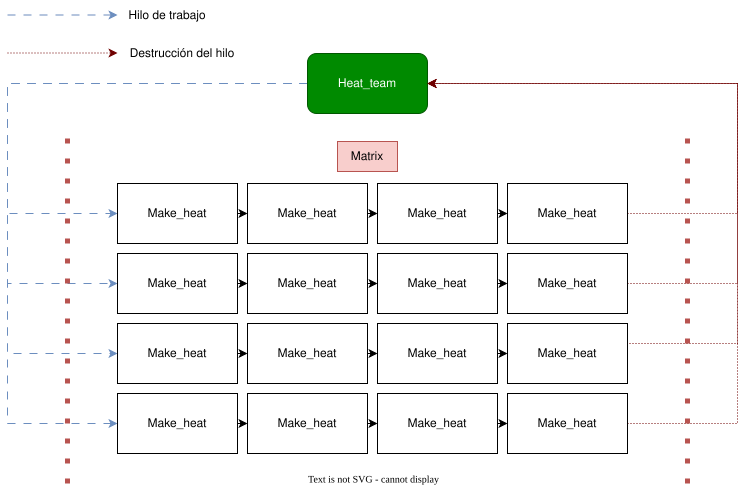

= Serial_heat_transfer_design

*Isaías Alfaro Ugalde <isaias.alfaro@ucr.ac.cr>*

---

:experimental:
:nofooter:
:source-highlighter: highlight.js
:sectnums:
:stem: latexmath
:toc:
:xrefstyle: short

== Diseño

---

== Estructura de datos

* *Matriz*: Al simular una lámina, buscamos recrearla en un programa con cierta exactitud respecto a una lámina en la vida real. Para ello, se optó por una matriz en la que inyectamos calor en los bordes durante la simulación, mientras que en las celdas interiores calculamos progresivamente la distribución del calor mediante una fórmula específica. 

=== Structs

El color morado pertenece a estos structs.

heat:: Esta estructura se utiliza para la matriz en la que se almacenan los dos momentos de calor, permitiendo avanzar en la simulación. Esto se debe a que se requieren tanto el estado actual como el siguiente momento, luego de completar un ciclo de simulación.

data_job:: Esta estructura almacena los datos de la placa y otros parámetros necesarios para la simulación actual. Se va sobreescribiendo a medida que avanzan las pruebas.

data_array:: Esta estructura contiene todos los datos extraídos del archivo job, con el propósito de abrir el archivo solo una vez y evitar operaciones repetidas de lectura.

=== Structs de hilos

El color naranja pertenece a estos structs.

shared_data:: Estructura que contiene los datos que van a compartir los hilos para su ejecución.

private_data:: Estructura que contiene los datos privados del hilo y puntero al mismo.

---

En este UML se quiere ejemplificar como es que estan trabajando los hilos, la funcion heat_team(verde) crea un equipo de hilos que son ejemplificados con las lineas azules, estos son enviados a trabajar en la matriz que se ejemplifica con las celdas negras y aplican la formula de calor que es la funcion make_heat, por ultimo cuando se termina el trabajo la funcion de heat_team elimina los hilos trabajadores y reporta el resultado de la matriz.

== Pthread

El programa hará uso de pthreads, una biblioteca que permite la utilización de hilos (threads), los cuales ayudan a paralelizar tareas y crear concurrencia en los programas. En este caso, se aplicará seguridad condicional, que se basa en la reparticion de trabajo en distintas partes de la memoria. Con el objetivo de aumentar la velocidad de las simulaciones.

En la imagen se observa cómo el método crea los hilos y los envía a trabajar. Cuando terminan, se vuelven a crear si es necesario otro conjunto para una nueva iteración, y se repite el proceso hasta alcanzar el equilibrio.

=== Metodos

Los metodos vistos en el UML son los metodos que tienen que ver con la simulacion de calor.

Make_data:: Crea y gestiona los datos para la simulación de calor. Asigna memoria para las estructuras necesarias, llama a las funciones para encontrar archivos, cargar datos y crear matrices.

Make_matrix:: Crea la matriz de datos de calor y gestiona el proceso de simulación. Llama a las funciones para cargar datos y crear matrices de calor

Heat_team:: Crea un equipo de hilos, estos son enviados a trabjar una fila especifica de la placa.

Make_heat:: Calcula y actualiza la distribución de calor en la placa. Utiliza el método de difusión para calcular la distribución del calor en la placa.

job_out_file:: Escribe los resultados en el archvio job y su respectivo plate.

== Solución es pseudocodigo

[#pseudocode]
[source,delphi]
----
include::matrix.pseudo[]
----
