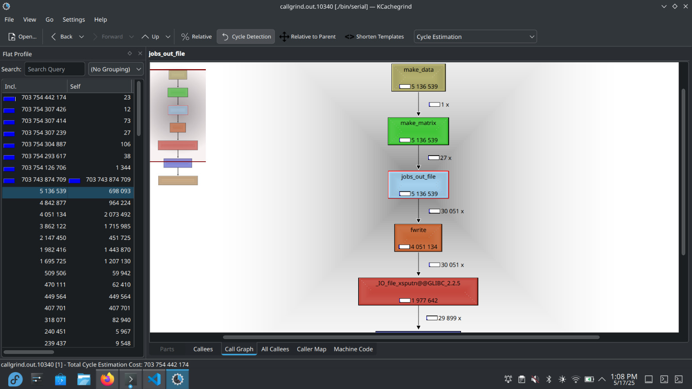

= Reporte de optimizaciones
:experimental:
:nofooter:
:source-highlighter: pygments
:sectnums:
:stem: latexmath
:toc:
:xrefstyle: short

[[serial_optimizations]]
== Optimizaciones seriales

[%autowidth.stretch,options="header"]
|===
|Iter. |Etiqueta |Duración (s) |_Speedup_ |Descripción corta
|0 |Serial0 |78.612 |1.00 |Versión serial inicial (Tarea01)
|1 |Serial1 |58.537 |1.34 |Versión con arrays en lugar de matrices (Tarea01)
|2 | | | |
|===

[[serial_iter00]]
=== Versión serial original (Tarea01)

La versión serial presenta dos grandes deficiencias: el manejo de archivos y el cálculo de las matrices. El primer aspecto es susceptible de optimización, ya que actualmente se abren los archivos múltiples veces. Para mejorar el rendimiento, se debería abrir cada archivo una sola vez, guardar la información necesaria y luego cerrarlo, en lugar de realizar múltiples aperturas. Al reducir estas operaciones, se disminuiría el tiempo de ejecución.

En cuanto a las matrices, el problema radica en la necesidad de recorrerlas completamente para actualizar sus valores en cada nuevo ciclo. Sin embargo, considero que este cálculo es rápido y eficiente en comparación con el impacto del manejo de archivos.

[[serial_iter01]]
=== Iteración 1

En esta iteración se cambió la estructura de datos que almacenaba la información de la placa. Se optó por utilizar dos arreglos que simulan ser una matriz, ya que esto mejora la eficiencia al evitar el costo asociado al acceso mediante índices en la msima. Un arreglo lineal no presenta este problema. Al implementarse esta esructura se aumento el rendimiento.

[source, c]
--
void matrix(int filas, int columnas, struct data_job *plate_data) {
  // array
  double* past_warm = calloc(filas*columnas, sizeof(double));
  double* current_warm = calloc(filas*columnas, sizeof(double));
  plate_data->current_warm = current_warm;
  plate_data->past_warm = past_warm;
}

void free_matrix(struct data_job *plate_data) {
  free(plate_data->past_warm);
  free(plate_data->current_warm);
}
--

[[concurrent_optimizations]]
== Optimizaciones concurrentes

[%autowidth.stretch,options="header"]
|===
|Iter. |Etiqueta |Duración (s) |_Speedup_ |Eficiencia |Descripción corta
|- |SerialI |58.537 |1.00 |1.00 |Versión serial final
|1 |Conc0 |1387.699 |1.00 |1.00 |Versión concurrente inicial (Tarea02)
|2 |Conc1 |1250.020 |1.11 |0.13 |Uso de barreras en lugar de Join (Tarea02)
|3 |Conc2 |56.060 |25.00 |3.125 |Versión concurrente final
|===

[[conc_iter00]]
=== Versión concurrente inicial (Tarea02)

La tarea02 presenta un problema importante: la creación y destrucción repetida de hilos en cada iteración de la simulación de la matriz. Este proceso genera una pérdida considerable de tiempo, especialmente notoria cuando la matriz tiene dimensiones pequeñas. La sobrecarga asociada a la gestión de hilos termina provocando un aumento significativo en el tiempo total de ejecución.

[[conc_iter01]]
=== Iteración 1

En esta iteración se implementó el uso de barreras en lugar de la función Join. Esta modificación permite que los hilos se sincronicen de manera más eficiente, evitando la necesidad de borrarlos y volverlos a crear cada que un ciclo de la simulación se completa. Al mantener los hilos activos durante toda la ejecución, se logra una mejora significativa en el rendimiento general del programa.

[source, c]
--
sem_wait(&shared_data->can_acces_count);
  shared_data->count = shared_data->count + 1;
  if (shared_data->count == shared_data->thread_count) {
    shared_data->balance = 1;
    shared_data->count = 0;
    for (u_int64_t i = 0; i < shared_data->thread_count; i++) {
      sem_post(&shared_data->barrier_work);
      }
  }
sem_post(&shared_data->can_acces_count);
sem_wait(&shared_data->barrier_work);
--

En este fraagmento de codigo se puede apreciar como se implemento una de las barreras que se usan durante el ciclo para sincornizar los hilos.

[[conc_iter02]]
=== Iteración 2

Esta optimizacion trata de mejorar un problema que tienen los hilos al ejecutar cantidades pequeñas de trabajo. Cuando la matriz es pequeña un solo hilo trabaja toda la matriz esto por que si son muchos se dura mas en todo el proceso de sincronizar los hilos que en el trabajo. Por lo cual es mejor que un solo hilo trabaje toda la matriz.

[source, c]
--
if (data_job->C > 500 && data_job->R > 500
  && shared_data->thread_count > 1) {
  // equipo de hilos
  heat_team(shared_data);
} else {
  // un solo hilo
  heat_serial(data_job);
}
--

[[optimization_comparison]]
=== Comparación de optimizaciones

(pendiente)

[[concurrency_comparison]]
=== Comparación del grado de concurrencia

(pendiente)
