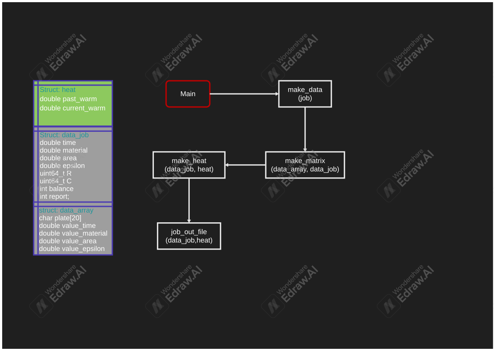
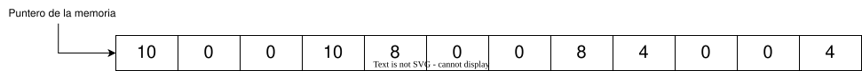

= Serial_heat_transfer_design

*Isaías Alfaro Ugalde <isaias.alfaro@ucr.ac.cr>*

---

:experimental:
:nofooter:
:source-highlighter: highlight.js
:sectnums:
:stem: latexmath
:toc:
:xrefstyle: short

== Diseño

---

== Estructura de datos

* *Array*: Al simular una lámina, buscamos recrearla en un programa con cierta exactitud respecto a una lámina en la vida real. Para ello, se opto por utilizar un arreglo unidimensional que simula una mtriz. Esto se puede ver como si se juntaran todas las filas de la matriz en una sola fila.

Aqui vemos como un ejemplo de como se veria el array guardado en memoria. En este caso, la matriz es de 3x4, por lo que se tienen 12 campos y vemos como cada fila se va guardando de una forma seguida.

=== Structs

En el programa existen tres structs.

heat:: Esta estructura se utiliza para la matriz en la que se almacenan los dos momentos de calor, permitiendo avanzar en la simulación. Esto se debe a que se requieren tanto el estado actual como el siguiente momento, luego de completar un ciclo de simulación.

data_job:: Esta estructura almacena los datos de la placa y otros parámetros necesarios para la simulación actual. Se va sobreescribiendo a medida que avanzan las pruebas.

data_array:: Esta estructura contiene todos los datos extraídos del archivo job, con el propósito de abrir el archivo solo una vez y evitar operaciones repetidas de lectura.

=== Metodos

Los metodos vistos en el UML son los metodos que tienen que ver con la simulacion de calor.

Make_data:: Crea y gestiona los datos para la simulación de calor. Asigna memoria para las estructuras necesarias, llama a las funciones para encontrar archivos, cargar datos y crear matrices.

Make_matrix:: Crea la matriz de datos de calor y gestiona el proceso de simulación. Llama a las funciones para cargar datos y crear matrices de calor

Make_heat:: Calcula y actualiza la distribución de calor en la placa. Utiliza el método de difusión para calcular la distribución del calor en la placa hasta que se alcanza el equilibrio.

job_out_file:: Escribe los resultados en el archvio job y su respectivo plate.
